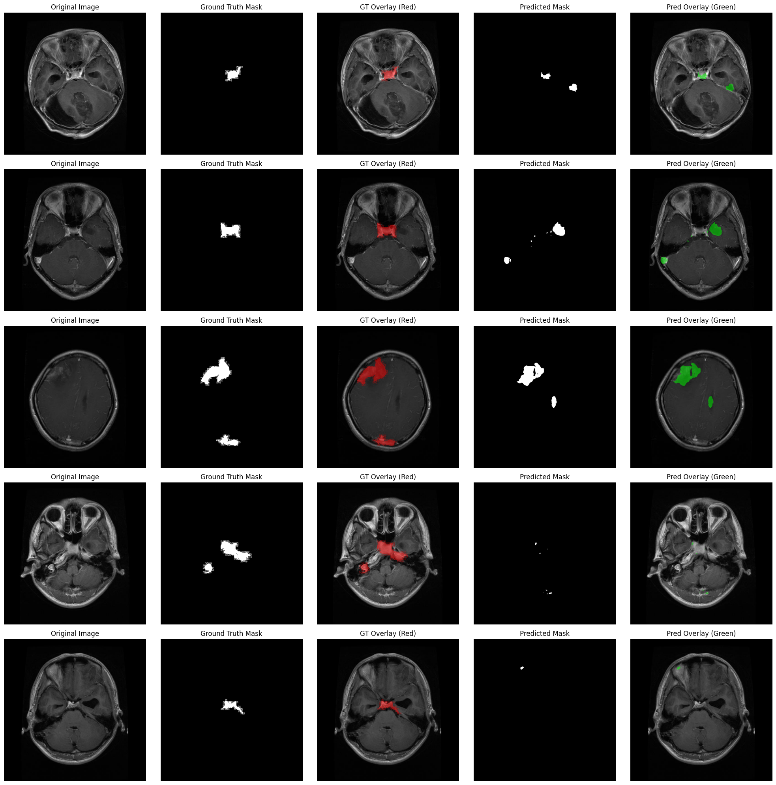

# Attention U-Net for Brain Tumor Analysis

This repository contains the implementation of an Attention U-Net model for brain tumor segmentation using the BRISC Dataset. The model is implemented in a Jupyter notebook and can be run on Kaggle.

## Project Overview

This project implements both a standard U-Net and an Attention U-Net architecture for accurate segmentation of brain tumors from MRI scans. The implementation includes:

1. **Attention U-Net Implementation**: A model that incorporates attention mechanisms to improve the segmentation accuracy by focusing on relevant features in the medical images.

2. **Standard U-Net Implementation**: A baseline U-Net model implementation for comparison purposes.

3. **Comparative Analysis**: The project includes a comparative analysis between the standard U-Net and Attention U-Net performances, allowing for evaluation of the impact of the attention mechanism on segmentation accuracy.

## Dataset

This project uses the BRISC Dataset, which can be found on Kaggle:
[BRISC Dataset](https://www.kaggle.com/datasets/salimmiah08/brisc-dataset/data)

## Running the Notebook on Kaggle

To run this project on Kaggle, follow these steps:

1. **Import the Dataset**
   - Go to the [BRISC Dataset](https://www.kaggle.com/datasets/salimmiah08/brisc-dataset/data) on Kaggle
   - Click the "Add to Dataset" button to add it to your Kaggle workspace
   - Note the dataset path which will be `/kaggle/input/brisc-dataset`

2. **Import the Notebook**
   - Visit [Kaggle Notebooks](https://www.kaggle.com/notebooks)
   - Click on "New Notebook"
   - Click on "File" > "Import Notebook"
   - Upload the `attention_unet_tumor_analysis.ipynb` file from this repository
   - Alternatively, you can directly copy the contents of the notebook into a new Kaggle notebook

3. **Configure the Environment**
   - Kaggle's environment comes with most required packages pre-installed
   - The notebook will use GPU acceleration if enabled in your Kaggle notebook settings
   - To enable GPU, go to the notebook settings (right sidebar) and select "GPU" under "Accelerator"

## Repository Structure

- `attention_unet_tumor_analysis.ipynb`: Main notebook containing both U-Net and Attention U-Net implementations, training code, and comparative analysis
- `history_attn_joint_main.json`: Training history for the Attention U-Net model with joint training
- `history_attn_seg_only_main.json`: Training history for the Attention U-Net model with segmentation-only training
- `README.md`: Project documentation and instructions

## Model Implementations

### Standard U-Net
- Implements the classic U-Net architecture for medical image segmentation
- Serves as a baseline model for performance comparison
- Implemented for direct comparison with Attention U-Net

#### Standard U-Net Segmentation Results

*The image shows the segmentation results of the standard U-Net model on brain tumor MRI scans. From left to right: Original MRI scan, Ground truth segmentation mask, U-Net predicted segmentation mask.*

### Attention U-Net
- Extends the U-Net architecture with attention mechanisms
- Designed to focus on relevant features during segmentation
- Two training approaches:
  1. Joint training (`history_attn_joint_main.json`)
  2. Segmentation-only training (`history_attn_seg_only_main.json`)

The notebook includes code for training both models and analyzing their segmentation performance, allowing for direct comparison of their effectiveness on the BRISC dataset.

## Requirements

The notebook requires the following main dependencies:
- TensorFlow
- Keras
- NumPy
- Matplotlib
- OpenCV
- scikit-learn

These packages are already available in the Kaggle environment.

## Contact

For any questions or issues, please open an issue in this repository.